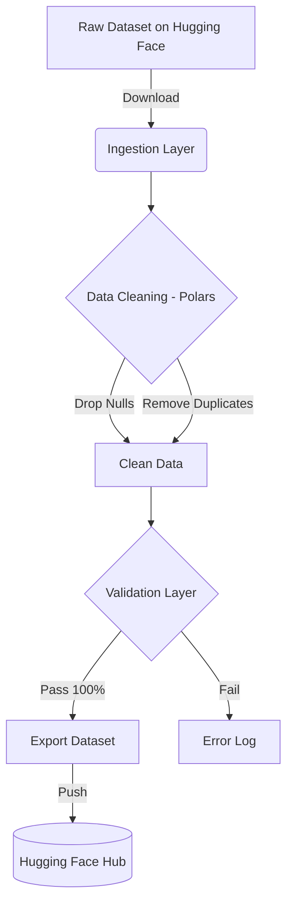

# 🚀 Enterprise Bilingual Data Pipeline (ID-EN)


An enterprise-grade automated data pipeline designed to ingest, clean, normalize, and validate Indonesian-English bilingual datasets for AI and Large Language Model (LLM) training.

---

## 🎯 The Problem: "Garbage In, Garbage Out"
In the era of Generative AI, the quality of a model is strictly bottlenecked by the quality of its training data. Raw datasets scraped from the internet are notoriously noisy, containing duplicates, missing translations, and corrupted formatting. 

This project solves this by introducing a **strict automated pipeline** that guarantees 100% data quality before it touches any AI model.

## 🏗️ Pipeline Architecture



## 🛠️ Tech Stack
- **Polars**: Chosen over Pandas for blazing-fast, multi-threaded data processing.
- **Hugging Face Datasets**: For seamless remote dataset ingestion and exportation.
- **Jupyter Notebook**: For initial data exploration and interactive data profiling.
- **Python**: Core scripting language.

## 🚀 How It Works

1. **Ingestion**: The script pulls the raw dataset `Kimsang766/agentic-ai-instructions-id-en` directly from the Hugging Face Hub.
2. **Sanitization (Polars)**: Processed in milliseconds to strip out missing values (`drop_nulls()`) and exact duplicates (`unique()`).
3. **Validation**: The dataset undergoes a strict assertion test to guarantee zero missing values and zero duplicates.
4. **Export**: The sanitized data is pushed back to production on Hugging Face.

## 📊 Results
- **Raw Data**: 945 rows
- **Cleaned Data**: 944 rows (1 garbage row removed)
- **Live Production Dataset**: [View on Hugging Face](https://huggingface.co/datasets/Kimsang766/agentic-ai-instructions-id-en-cleaned)

## 💻 How to Run Locally

1. **Clone the repository:**
   ```bash
   git clone https://github.com/kim40404/id-en-data-pipeline.git
   cd id-en-data-pipeline
   ```
2. **Install dependencies:**
   ```bash
   pip install -r requirements.txt
   ```
3. **Authenticate with Hugging Face:**
   ```bash
   hf auth login
   ```
4. **Execute the pipeline:**
   ```bash
   python src/cleaner.py
   ```
